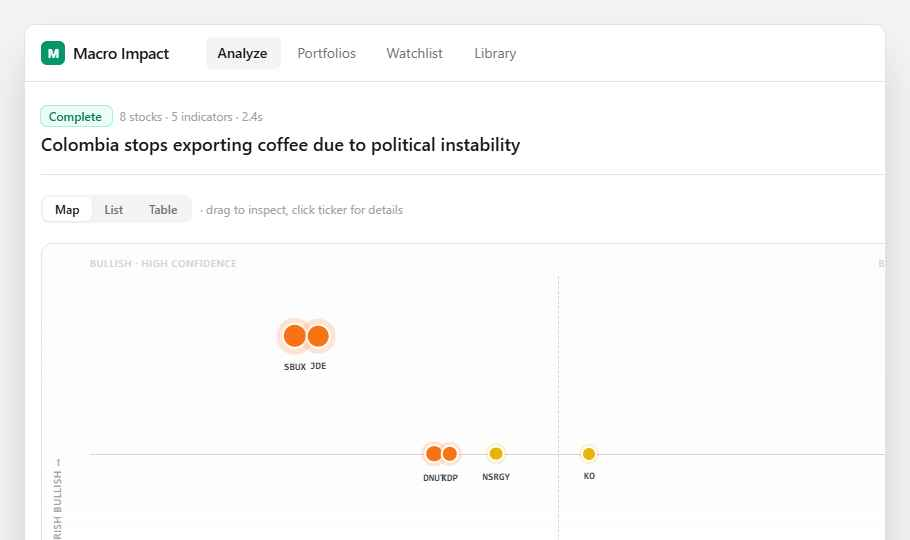

# 02 — Impact Map

A **scatter-plot view** of analysis results: impact score on X, confidence on Y, bubble size = magnitude, color = direction. Surfaces "high-impact, high-confidence" picks at a glance for portfolios with many stocks.



Open `preview.html` in any browser to see the live prototype.

## Purpose

The current analysis page lists stocks vertically. With 20+ stocks, you can't see the shape of exposure — which cluster matters most, which are noise. A scatter plot gives that shape instantly.

## Where it goes

**Page:** `src/app/analysis/[id]/page.tsx`
**Add:** a view-toggle (Map / List / Table) above the results, defaulting to List for ≤8 stocks and Map for more.

## What to build

### 1. New component: `src/components/ImpactMap.tsx`

Props: `{ results: StockResult[] }`

Layout (see `preview.html` for exact spacing):
- A 420px-tall white `<Card>` with a relative-positioned plot area.
- Center crosshair: horizontal line at 50% (zero impact), vertical dashed line at 50% (medium confidence).
- 4 quadrant labels in the corners (10px uppercase, `text-zinc-300`, `tracking-wider`).
- Y-axis label rotated 90° on the left: "← bearish    bullish →" (use `writingMode: vertical-rl`).
- X-axis label centered along bottom: "← low conf    high conf →".

Each `StockResult` plotted as:
- **Position**: `left = 50% + (impactScore / 6) * 45%`; `top` mapped from `confidence` (high=22%, medium=50%, low=75%).
- **Bubble**: outer halo `rgba(color, 0.18)` sized `16 + |score|*6` px, inner solid disc 60% of that, ring-2 ring-white.
- **Color**: `#10b981` if score > 1, `#f97316` if score < -1, `#eab308` otherwise.
- **Label**: ticker mono 10px below the bubble.
- **Hover**: dark tooltip (`bg-zinc-900 text-white text-[11px]`) above bubble showing ticker, score, and `overallReasoning`.

### 2. Cluster summary cards (3 across, below the map)

- **Most exposed** (orange): top 2-3 with score < -1
- **Watch** (yellow): -1 ≤ score < 1
- **Safe / beneficiaries** (green): score ≥ 1

Each card: `<Card className="p-4">` with uppercase 11px label, mono ticker list, one-line description.

### 3. View toggle

Pill group above the map:
```tsx
<div className="inline-flex bg-zinc-100 rounded-lg p-0.5">
  {['map', 'list', 'table'].map(v => (
    <button className={cx('px-3 py-1 rounded-md text-xs font-medium',
      view === v ? 'bg-white text-zinc-900 shadow-sm' : 'text-zinc-500')}>{v}</button>
  ))}
</div>
```

`'list'` should render the existing `<ImpactCard>` stack. `'table'` reuses `<PortfolioSummary>` (already in the page).

### 4. Behavior notes

- For ≤8 results, default view is `list`. For more, default is `map`.
- Errored results (`result.error`) are excluded from the map but listed in a "could not analyze" footnote.
- The threshold slider already on the page should still control which correlations are highlighted, but does not affect map rendering.

## Design tokens

| Token | Value |
|---|---|
| Bullish | `#10b981` (emerald-500) |
| Bearish | `#f97316` (orange-500) |
| Neutral | `#eab308` (yellow-500) |
| Card border | `#e4e4e7` (zinc-200) |
| Axis line | `#d4d4d8` (zinc-300) |
| Quadrant label | `#d4d4d8` (zinc-300), 10px uppercase, `tracking-wider` |
| Tooltip bg | `#18181b` (zinc-900) |

## Out of scope

- Click-to-drill-into-card. (Future: clicking a bubble scrolls to that stock's detailed `<ImpactCard>` below.)
- Drag/zoom on the plot.
- Confidence is currently a 3-value enum (`'high' | 'medium' | 'low'`) — if you add a numeric `confidenceScore` later, refine Y mapping.
