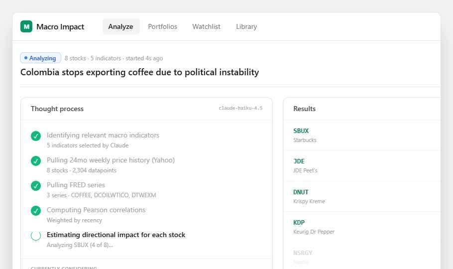

# 04 — Live Stream

A **two-column streaming view** for in-progress analyses: Claude's thought process on the left, results streaming in on the right. Replaces the current single "Progress" card.



Open `preview.html` in any browser to see the live prototype.

## Purpose

The current progress panel is informative but feels like a loading spinner. Users want to know *what Claude is thinking* and *which results are already done* — surfacing both keeps them engaged during long runs and builds trust.

## Where it goes

**Page:** `src/app/analysis/[id]/page.tsx`
**Replaces:** the existing `{(status === 'running' || steps.length > 0) && <Card>...</Card>}` Progress block.

The streaming infrastructure already exists — this is a UI change only. The current SSE handler in `page.tsx` already accumulates `steps`, `indicators`, and `results`. Use those.

## What to build

### Layout

Two-column grid (`grid grid-cols-2 gap-5`) shown while `status === 'running'`. Once `status === 'complete'`, this whole block can fade out / collapse.

### Left column: Thought process

```tsx
<Card>
  <header>Thought process · <span>claude-haiku-4.5</span></header>
  <div className="p-5 space-y-3">
    {steps.map(s => (
      <Step done={…} title={s} detail={inferredDetail(s)} />
    ))}
  </div>
  <div className="border-t bg-zinc-50/50">
    <span>Currently considering</span>
    <p className="text-xs font-mono">{liveSnippet}<cursor /></p>
  </div>
</Card>
```

Each step row: 5×5 spinner or check, title (`text-sm`, dimmed when done), detail (`text-xs text-zinc-400`).

The "Currently considering" bottom panel shows a streaming snippet of Claude's most recent thinking. **This requires a new SSE event type** — see "Backend changes" below.

### Right column: Streaming results

```tsx
<Card>
  <header>Results · {ready} of {total} ready</header>
  <div className="divide-y">
    {results.map(r => <ResultRow result={r} />)}
    {queued.map(t => <PlaceholderRow ticker={t} />)}
  </div>
</Card>
```

Each result row:
- Mono ticker (`text-emerald-700`), name (`text-zinc-400`).
- `ImpactBar` (the existing one from `ImpactCard.tsx`).
- Score in mono, color-coded.

Queued rows render at `opacity-40` with a small spinner where the score will be.

### Header strip

Above both columns:
```tsx
<Badge variant="indigo">
  <span className="w-1.5 h-1.5 rounded-full bg-blue-500 mr-1 animate-pulse" />
  Analyzing
</Badge>
<span>{n} stocks · {m} indicators · started {elapsed}s ago</span>
<span className="ml-auto">est. {remaining}s remaining</span>
```

ETA: estimate by `(elapsedSec / resultsReady) * (totalStocks - resultsReady)`. Skip until at least 1 result is in.

## Backend changes (small)

To power "Currently considering", add one new SSE event type in `src/lib/types.ts`:

```ts
type SSEEvent =
  | { type: 'step'; message: string }
  | { type: 'thinking'; ticker?: string; snippet: string }   // NEW
  | { type: 'indicators'; indicators: Indicator[] }
  | { type: 'result'; result: StockResult }
  | { type: 'complete' }
  | { type: 'error'; message: string };
```

In `src/app/api/analysis/[id]/stream/route.ts`, when streaming each per-stock Claude response, emit `{ type: 'thinking', ticker, snippet }` periodically (e.g., every 200 chars) using the streaming text from the Anthropic SDK. Buffer to the latest 300 chars on the client.

If shipping the backend change is out of scope, **fall back gracefully**: omit the "Currently considering" panel entirely and let the steps + ETA carry the experience.

## State on the client

```ts
const [thinkingSnippet, setThinkingSnippet] = useState('');
const [resultsReady, setResultsReady] = useState(0);
const [startedAt] = useState(Date.now());

// in onmessage:
if (evt.type === 'thinking') setThinkingSnippet(evt.snippet);
if (evt.type === 'result') setResultsReady(n => n + 1);
```

ETA derivation in render:
```ts
const elapsed = (Date.now() - startedAt) / 1000;
const remaining = resultsReady > 0
  ? Math.max(0, Math.round((elapsed / resultsReady) * (total - resultsReady)))
  : null;
```

## Design tokens

Existing app tokens — emerald-600 primary, zinc neutrals, Geist Mono for ticker/snippet text. The blinking cursor is `inline-block w-1.5 h-3 bg-zinc-700 ml-0.5 animate-pulse`.

## Acceptance

- [ ] Two-column layout while running, collapses on complete.
- [ ] ETA appears once 1+ result is in.
- [ ] Result rows animate in (any subtle entry — `opacity` + `translate-y`).
- [ ] Queued rows visible from the start, pulled from `analysis.stockUniverse`.
- [ ] If `thinking` events aren't emitted, layout still works without the bottom panel.

## Out of scope

- Persisting the thought-process scroll (just append-only is fine).
- A "show full reasoning" expand. (Future: maintain a transcript and let users scroll back.)
