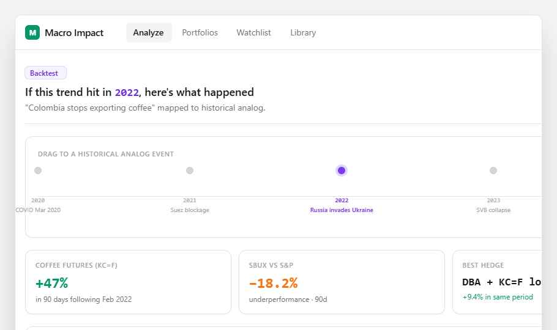

# 06 — Backtest / Time Travel

Map the user's macro trend to a **historical analog event** and show what *actually happened* to comparable stocks. A timeline scrubber lets the user pick the analog (or auto-select).



Open `preview.html` in any browser to see the live prototype.

## Purpose

Generic LLM stock chat is hand-wavy. This feature gives sharp, defensible answers using real historical data: *"In Feb 2022 (Russia-Ukraine), KC=F rose 47% in 90d, SBUX underperformed S&P by 18.2%."* Pairs naturally with the existing analysis flow — run an analysis, then click "see the historical analog."

## Where it goes

**New route:** `src/app/analysis/[id]/backtest/page.tsx`
**Entry point:** Add a "Backtest this trend" button on the analysis results page (`src/app/analysis/[id]/page.tsx`) — only enabled once `status === 'complete'`.

Or, simpler v1: a section on the analysis page itself, below results.

## What to build

### 1. Pick the analog event

When the user lands on `/backtest`, fetch a list of candidate analogs from a new endpoint (or hard-code a curated list to start):

```ts
// src/lib/analogs.ts
export const HISTORICAL_EVENTS = [
  { id: 'covid-2020',    year: 2020, date: '2020-03-11', label: 'COVID declared pandemic',
    tags: ['supply-shock', 'demand-shock', 'global'] },
  { id: 'suez-2021',     year: 2021, date: '2021-03-23', label: 'Suez blockage', tags: ['supply-chain'] },
  { id: 'ukraine-2022',  year: 2022, date: '2022-02-24', label: 'Russia invades Ukraine',
    tags: ['supply-shock', 'commodity', 'geopolitical'] },
  { id: 'svb-2023',      year: 2023, date: '2023-03-10', label: 'SVB collapse', tags: ['banking', 'rates'] },
  { id: 'yen-2024',      year: 2024, date: '2024-08-05', label: 'Yen carry unwind', tags: ['fx', 'liquidity'] },
];
```

Use Claude (with the existing `@anthropic-ai/sdk` integration) to **rank these analogs** by relevance to the user's trend. Cheap one-shot call:
> "Rank these historical events by how analogous each is to: '{trend}'. Return top 3 with one-sentence justification each."

Default-select the top match; let the user click another dot on the timeline to override.

### 2. Layout

Top header (matches existing pages):
```tsx
<Badge variant="purple">Backtest</Badge>
<h1>If this trend hit in <span className="font-mono text-violet-700">{year}</span>, here's what happened</h1>
<p className="text-zinc-500">"{trend}" mapped to historical analog.</p>
```

### 3. Timeline scrubber

A horizontal track with dots at each event's year. See `preview.html` for exact styling — selected dot is `bg-violet-600 ring-4 ring-violet-200`, unselected `bg-zinc-300`. Year + label below each dot. Clickable to switch analog.

### 4. Stat cards (3 across)

Pull real numbers in the 90-day window after the event:
- **Indicator move**: `+47%` for the most relevant indicator (e.g. `KC=F` for a coffee trend). Use the existing `yahoo-finance2` integration.
- **Stock vs S&P**: top-impact stock's relative performance vs SPX in same window.
- **Best hedge**: which indicator/ETF rose most. Use a small candidate list (`DBA`, `GLD`, `VIX`, sector ETFs, the trend's primary commodity).

Each card: `<Card className="p-4">` with uppercase 11px label, large number in mono (`text-2xl font-bold`), color-coded (emerald for positive, orange for negative), small grey caption.

### 5. Price overlay chart

Use the existing `recharts` (`LineChart`) — the project already has `<CorrelationChart>` as a model. Plot:
- Primary indicator (solid emerald line)
- Top-impact stock (dashed orange line)
- A vertical violet dashed line at the event date with a small "Event" label.

Window: 90 days before through 180 days after the event.

## Backend / data

**New endpoint:** `src/app/api/backtest/route.ts` (POST)

Request:
```ts
{ analysisId: string, eventId: string }
```

Response:
```ts
{
  event: { id, date, label },
  indicatorMove: { ticker: string, name: string, pctChange: number, windowDays: 90 },
  topStockVsSpx: { ticker: string, deltaPct: number },
  bestHedge: { ticker: string, name: string, pctChange: number },
  series: { date: string, indicator: number, stock: number }[],  // for chart
}
```

Internally:
1. Load the analysis (Prisma) to get `indicators` and the top-impact stock.
2. Hit Yahoo Finance for the date window.
3. Compute the three stat-card numbers.
4. Cache by `(analysisId, eventId)` — backtest results are deterministic.

## Design tokens

| Token | Value | Use |
|---|---|---|
| Backtest accent | `#7c3aed` (violet-600) | Badges, scrubber dot, event line |
| Indicator line | `#10b981` (emerald-500) | Solid line in chart |
| Stock line | `#f97316` (orange-500), `strokeDasharray="3 2"` | Dashed line in chart |

## Acceptance

- [ ] Auto-select most relevant analog on first load (Claude ranks).
- [ ] Click any timeline dot to switch — stats and chart re-fetch.
- [ ] Stats cards show real Yahoo Finance numbers (not hard-coded).
- [ ] Loading state for stats + chart (skeleton or spinner).
- [ ] If Yahoo fetch fails for an event (e.g. ticker didn't exist yet), show a friendly "no data for this analog" inline.

## Out of scope (v1)

- User-submitted custom analog dates.
- Multi-stock overlay (start with the top-impact stock only).
- Saving backtest as a "view" — for v1, it's a transient page reachable from analysis.
