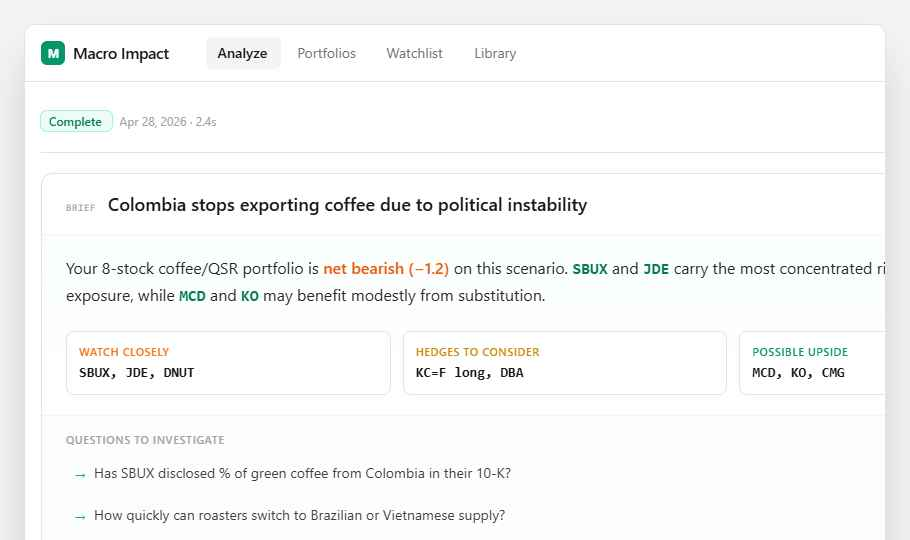

# 07 — Narrative Brief

A **portfolio-level TL;DR** card that sits at the top of completed analyses: winners, losers, hedges, and questions to investigate. One-click copy as Slack-formatted markdown.



Open `preview.html` in any browser to see the live prototype.

## Purpose

Today the analysis page is "scan 8 detailed cards." For sharing with colleagues or quick decision-making, users need a 30-second summary. This card supplies it.

**This is the smallest of the 4 concepts — ship it first.** It's purely additive to the existing analysis page.

## Where it goes

**Page:** `src/app/analysis/[id]/page.tsx`
**Insert:** above the existing `<PortfolioSummary>` block, only when `status === 'complete'`.

## What to build

### 1. Generate the brief content

Add one Claude call after results stream completes. New endpoint or extend the existing analysis pipeline to emit a `brief` field:

```ts
// extend Analysis schema (Prisma) or store in JSON `summary` column:
type AnalysisBrief = {
  oneLineNet: string;       // "Your portfolio is net bearish (-1.2) on this scenario."
  paragraph: string;        // 2-3 sentence narrative naming key tickers
  watchClosely: string[];   // top 2-3 tickers
  hedges: string[];         // suggested hedges (e.g. ["KC=F long", "DBA"])
  upside: string[];         // potential beneficiaries
  questions: string[];      // 3 follow-up research questions
  avgConfidence: number;    // 0-1
  tailRisk: string;         // one-line caveat
}
```

Prompt template (single Claude call, ~$0.01 with Haiku):
> Given this completed analysis ({trend}, {results}, {indicators}), write a portfolio-level brief. Output JSON matching this schema: {…}. Be specific — name tickers, cite numbers. Questions should be researchable, not rhetorical.

Persist to `Analysis.summary` (new optional JSON column).

### 2. Component: `src/components/NarrativeBrief.tsx`

Props: `{ analysis: AnalysisRecord, brief: AnalysisBrief }`

Layout:

```tsx
<Card className="overflow-hidden">
  {/* Header strip */}
  <div className="px-6 py-4 border-b border-zinc-100 flex items-baseline gap-3">
    <span className="text-[10px] uppercase tracking-wider text-zinc-400 font-mono">Brief</span>
    <h1 className="text-lg font-semibold text-zinc-900">{trend}</h1>
  </div>

  {/* Hero */}
  <div className="px-6 py-5 space-y-4 bg-gradient-to-b from-emerald-50/30 to-white">
    <p className="text-base text-zinc-800 leading-relaxed">{brief.paragraph}</p>

    <div className="grid grid-cols-3 gap-3 pt-2">
      <Bucket tone="orange" label="Watch closely" tickers={brief.watchClosely} />
      <Bucket tone="yellow" label="Hedges to consider" tickers={brief.hedges} />
      <Bucket tone="emerald" label="Possible upside" tickers={brief.upside} />
    </div>
  </div>

  {/* Questions */}
  <div className="px-6 py-4 border-t border-zinc-100 bg-zinc-50/40">
    <span className="text-[11px] uppercase tracking-wider text-zinc-400">Questions to investigate</span>
    {brief.questions.map(q => (
      <button className="w-full text-left text-sm text-zinc-700 hover:bg-white rounded-md px-2 py-1.5 flex gap-2">
        <span className="text-emerald-500 mt-0.5">→</span>{q}
      </button>
    ))}
  </div>
</Card>
```

`<Bucket>` is a small inline subcomponent: white card with uppercase tone-colored label and mono ticker list.

### 3. Confidence + caveats strip (3 small cards below the brief)

- **Avg confidence**: percentage in an emerald box; subtitle "5 high · 2 medium · 1 low".
- **Tail risk**: yellow ⚠ box with `brief.tailRisk` one-liner.
- **Not advice**: zinc info box; static text.

### 4. Action buttons (top-right of the page)

```tsx
<Button variant="secondary" size="sm" onClick={copyAsSlack}>Copy as Slack</Button>
<Button variant="secondary" size="sm" onClick={exportPdf}>Export PDF</Button>
```

`copyAsSlack` formats the brief as Slack-flavored markdown:
```
*Macro Impact: {trend}*
{brief.paragraph}

*Watch closely:* `SBUX` `JDE` `DNUT`
*Hedges:* `KC=F long` `DBA`
*Possible upside:* `MCD` `KO` `CMG`

_Confidence {avgConfidence}% · Not investment advice_
```
…and writes to `navigator.clipboard.writeText`. Toast a small "Copied" confirmation (use a 2s timeout pill).

`exportPdf` can be a v2 stub — `window.print()` with a print stylesheet works for v1.

## Design tokens

All existing — no new tokens needed.

| Element | Value |
|---|---|
| Card subtle gradient | `bg-gradient-to-b from-emerald-50/30 to-white` |
| Watch tone | `text-orange-500` |
| Hedge tone | `text-yellow-600` |
| Upside tone | `text-emerald-600` |
| Question arrow | `text-emerald-500` |

## State

```ts
// in analysis/[id]/page.tsx
const [brief, setBrief] = useState<AnalysisBrief | null>(analysis?.brief ?? null);

useEffect(() => {
  if (status === 'complete' && !brief) {
    fetch(`/api/analysis/${id}/brief`, { method: 'POST' })
      .then(r => r.json()).then(setBrief);
  }
}, [status, brief]);
```

If `brief` exists on the loaded analysis (already-complete record), skip the fetch.

## Acceptance

- [ ] Brief renders only when `status === 'complete'` and at least 1 valid (non-error) result exists.
- [ ] Tickers in the brief link to the corresponding `<ImpactCard>` below (anchor scroll).
- [ ] Copy-as-Slack writes to clipboard and shows toast confirmation.
- [ ] Brief is persisted; refreshing the page does not regenerate it.
- [ ] If brief generation fails (Claude error), show a small "Could not generate summary" inline note but don't break the page.

## Out of scope (v1)

- "Ask Claude" button on each question (future: turn each question into a follow-up Claude call with results context).
- PDF export (use `window.print()` for v1).
- Editing the brief inline.
